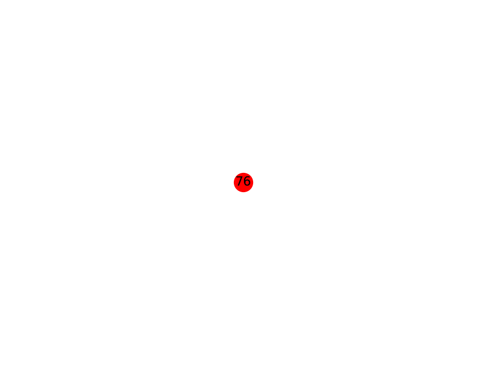

# Minomaly: A Subgraph Mining Framework for Unsupervised and Explainable Anomaly Detection in Graphs

Minomaly is a scalable and interpretable graph anomaly detection method designed to identify rare and anomalous subgraph structures of nodes in large-scale graphs. This repository provides the implementation of Minomaly, along with datasets, instructions for running the method, and access to experimental results.

## Datasets

The datasets used in the experiments can be accessed from the following link:

[Download Datasets](https://drive.google.com/drive/folders/162jgos2K8ITkWauyCeG-5vkRUV-9xlQX?usp=sharing) (source: [Data Repository for PyGOD](https://github.com/pygod-team/data))

## Running Minomaly

To run Minomaly on the Cora, Amazon, and Flickr datasets, use the following commands:

### Cora Dataset

```bash
python3 -m minomaly_struct.decoder \
    --dataset=inj_cora \
    --node_anchored \
    --min_neighborhood_size=1 \
    --max_neighborhood_size=30 \
    --nodes_batch_size=100 \
    --max_unchanged=5 \
    --add_verified_neighs \
    --alpha=0.33 \
    --min_steps=7 \
    --max_steps=7 \
    --max_freq=35 \
    --n_neighborhoods=10000 \
    --batch_size=1000 \
    --n_threads=8;
```

### Amazon Dataset

```bash
python3 -m minomaly_struct.decoder \
    --dataset=inj_amazon \
    --node_anchored \
    --min_neighborhood_size=1 \
    --max_neighborhood_size=30 \
    --nodes_batch_size=100 \
    --max_unchanged=3 \
    --max_cands=20 \
    --alpha=0.33 \
    --min_steps=11 \
    --max_steps=11 \
    --max_freq=150 \
    --n_neighborhoods=50000 \
    --add_verified_neighs \
    --min_neigh_repeat=1 \
    --batch_size=10000 \
    --n_threads=8;
```

### Flickr Dataset

```bash
python3 -m minomaly_struct.decoder \
    --dataset=inj_flickr \
    --node_anchored \
    --min_neighborhood_size=1 \
    --max_neighborhood_size=30 \
    --nodes_batch_size=100 \
    --max_unchanged=3 \
    --max_cands=10 \
    --alpha=0.33 \
    --min_steps=7 \
    --max_steps=7 \
    --max_freq=1000 \
    --n_neighborhoods=150000 \
    --add_verified_neighs \
    --min_neigh_repeat=0 \
    --batch_size=10000 \
    --n_threads=8;
```

## Results

The experimental results are stored in the directory `plots/`.

### Anomalous Patterns

The discovered anomalous structure patterns are saved in the directory `plots/[experiment]/cluster/`.



## Contact

For questions, issues, or contributions, please create an issue in this repository or contact the author via the repository's GitHub page.

