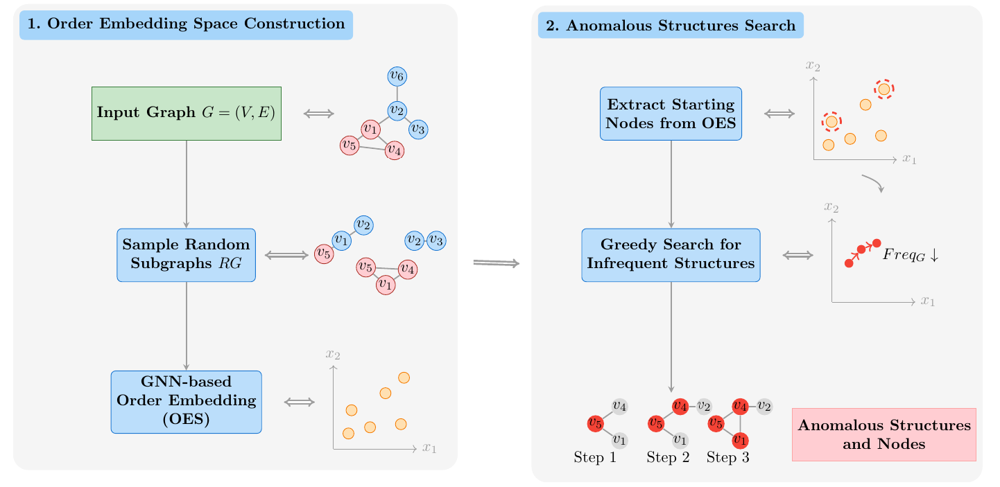
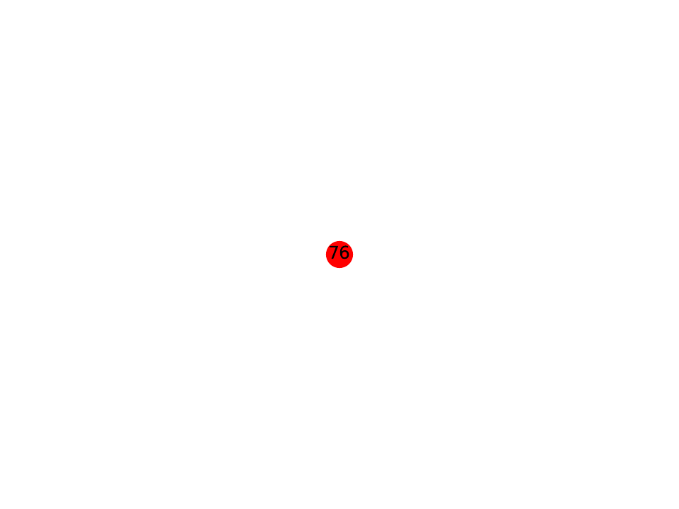

# Minomaly

Unsupervised structural anomaly detection in graphs.

Minomaly combines subgraph mining with GNN-based order embeddings to detect rare node neighborhoods indicative of structural anomalies. By embedding subgraphs into an Order Embedding Space (OES), Minomaly estimates subgraph frequencies and employs a greedy search algorithm to expand infrequent node structures, with interpretable and controllable hyperparameters.





## Installation

Requires Python 3.10+, PyTorch 2.4+, PyG 2.6+.

```bash
pip install torch torch-geometric networkx scikit-learn scipy matplotlib tqdm pyyaml dacite
```

## Datasets

Datasets auto-download from [PyGOD](https://pygod.org/). Structural anomaly labels: `(data.y >> 1) & 1`.

- **Cora** — citation network (2,708 nodes, 5,429 edges)
- **Amazon** — co-purchase network (13,752 nodes, 287,209 edges)
- **Flickr** — image sharing network (89,250 nodes, 899,756 edges)

## Quick Start

```bash
# Run detection on Cora
python -m minomaly --config configs/cora_order_glass_fast.yaml

# Run detection on Amazon
python -m minomaly --config configs/amazon_order_glass_canon.yaml

# Run detection on Flickr
python -m minomaly --config configs/flickr_order_glass_v2.yaml
```

Override any parameter via CLI dot-notation:

```bash
python -m minomaly --config configs/cora_order_glass_fast.yaml search.max_steps=9 search.n_beams=5
```

## DSAN

DSAN (Deep Subgraph Anomaly Network) is an order-embedding model for subgraph mining trained on synthetic graphs. A pre-trained checkpoint is provided in `ckpt_order_glass/best_model.pt`. The same trained model is reused across all datasets without retraining.

DSAN uses GLASS-style two-dimensional structural labeling (anchor indicator + subgraph membership), a smooth softplus order-embedding loss, and a training set covering five random graph generators (ER, WS, BA, PowerLaw-Cluster, Ensemble). It achieves 95% accuracy on subgraph containment queries.

To train from scratch:

```bash
python -m minomaly --config configs/train_order_glass.yaml --train
```

## Configurations

| Config | Dataset | Description |
|--------|---------|-------------|
| `cora_order_glass_fast.yaml` | Cora | C₁: k=10k, max_steps=6, n_beams=3 |
| `amazon_order_glass_canon.yaml` | Amazon | A₁: k=50k, max_steps=11, n_beams=2 |
| `flickr_order_glass_v2.yaml` | Flickr | F₁: k=175k, max_steps=5 |
| `flickr_order_glass_F2.yaml` | Flickr | F₂: k=200k |
| `flickr_order_glass_F3.yaml` | Flickr | F₃: k=250k |
| `citeseer_dice_order.yaml` | CiteSeer | DICE structural injection robustness |
| `fraud_amazon.yaml` | FraudAmazon | Real-world fraud detection |
| `train_order_glass.yaml` | Synthetic | DSAN training (100k batches) |

## Results

Canonical detection results are stored in `results/` with anomaly scores, summary figures, and interpretation plots for each dataset.

## Docker

```bash
docker build -t minomaly .
docker run --gpus all minomaly --config configs/cora_order_glass_fast.yaml
```
